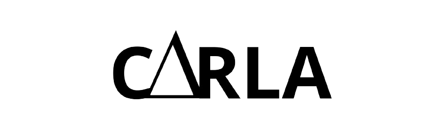

<div align="center">
  
  <h1>What is "Carla"?</h1>
  <p>Carla is a programming language project with a different approach than others.</p>
  <a href="#carla-fundamentals">See more about the differences and fundamentals!</a>
  
</div>
<br>

- [CARLA YT VIDEO](https://www.youtube.com/watch?v=G0_mBSvDEmE&t=199s)
```carla
#include <stdio> 

int32 main = (int32 argc, []byte* argv) {
  []byte msg = "Hello, World";
  io::println(msg);

  return 0;
}
```
<br>
<br>
<br>

# Carla Fundamentals
### About
Carla is a pattern created by a young programmer, who felt tired of languages ​​and their paradigms. Where, he was always very fond of fundamentalism and modernizing every little thing as much as possible. Inspired by the fundamentals of C, the beauty of Rust, and admired by the Heskell difference, he started the **Carla** project.

### Fundamentals  
- Practicality
- Modernity 
- Fundamentalism
- Mathematical ease

# And what is Carla's objective?
Carla's true objective is to draw attention to the "Carla protocol". Therefore, some standards that, if followed, could change the direction of current computing.

### What was the initial spark for the creation of Carla?

Have you ever entered a Discord, Telegram or Whatsapp chat and seen a lot of people struggling with JavaScript, Python, Ruby? This is exactly what served as the snap.

### After all, what is the purpose?
If you are tired of using programming every day, for example, if you want your code not to break, put an `try` in the code, and it will not give a **Segmentation fault**.

In other words, don't surrender to the current schedule. Opt for the rational programming choice, Carla Protocol. It doesn't make sense to program without knowing how much memory is used to allocate a pointer, and things like that.

#

<div align="center">

### Carla's concept is to be simple, modern and as close to C as possible.

#

<table>
  <tr></tr>
  <tr>
    <!-- Documentation -->
    <td>Documentation</td>
    <td> 
      <a href="./docs/carla.md">
        
      </a>
    </td>
  </tr>
  <tr>
    <!-- License -->
    <td>License</td>
    <td> 
      <a href="./LICENSE">
        
      </a>
    </td>
  </tr>
  <tr>
    <!-- Carla protocol -->
    <td>Carla protocol</td>
    <td> 
      <a href="./LICENSE">
      <a href="./PROTOCOL.md">
        
      </a>
    </td>
  </tr>
</table>
See what a language needs to fit into the carla protocol
</div>
